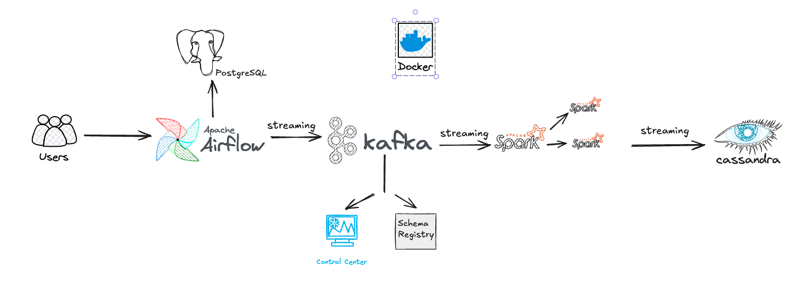
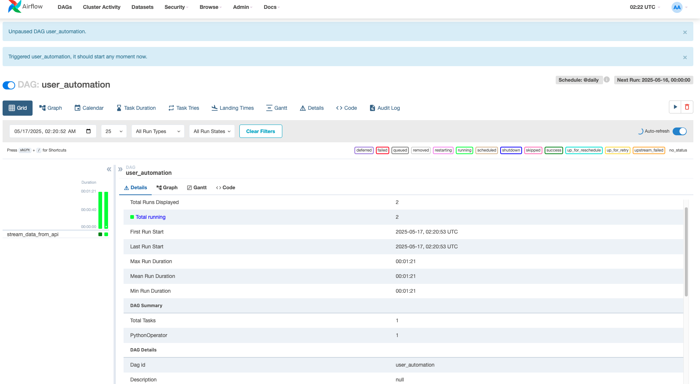
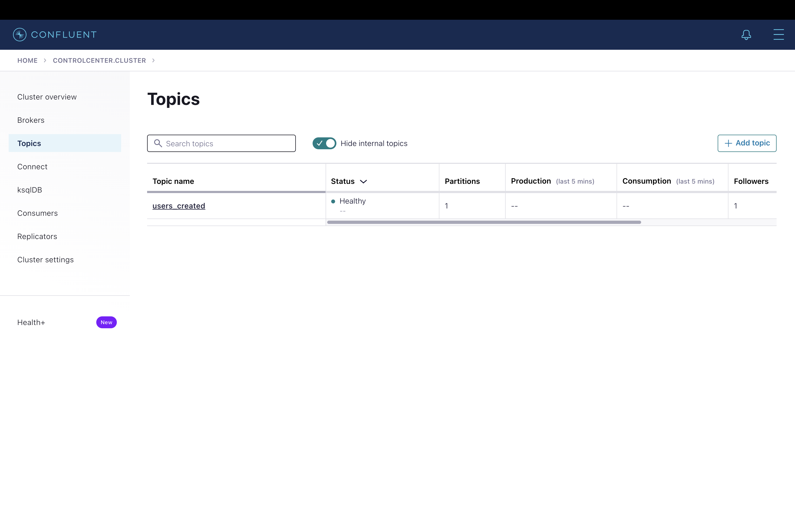
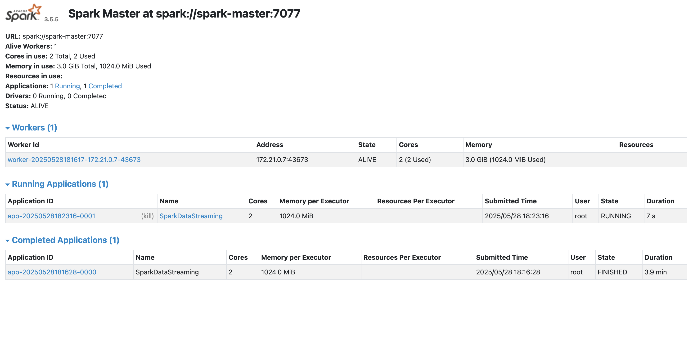
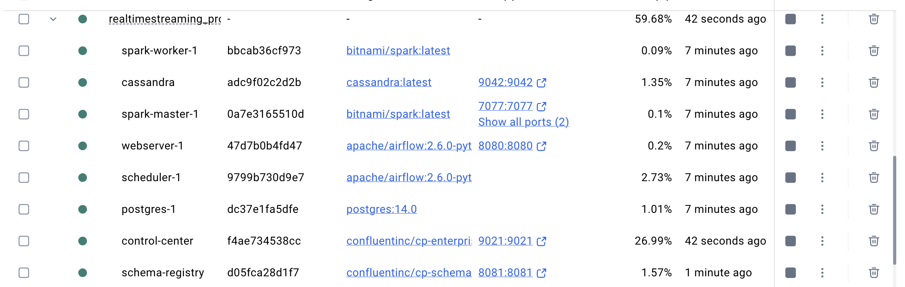

# Real-Time-Data-Streaming
🔧 Project Overview
This project demonstrates a real-time data streaming architecture built using modern data engineering tools. It simulates real-world scenarios by fetching random user data from an external API, pushing it into a Kafka topic, processing it with Apache Spark, and persisting it into Apache Cassandra — all orchestrated using Apache Airflow and containerized using Docker Compose.
<!-- ./realTIme_PIC/architecture.pn -->
<p align="center">  </p>

---

## 🔧 Tech Stack

- **Apache Kafka** – Message broker for real-time data streaming
- **Apache Airflow** – DAG scheduler for orchestrating ETL tasks
- **Apache Spark** – Stream processing with structured streaming
- **Apache Cassandra** – NoSQL database for scalable data storage
- **Docker Compose** – Multi-container orchestration
- **PostgreSQL** – Backend metadata DB for Airflow
- **Schema Registry & Control Center** – Kafka schema & monitoring

## 📁 Folder Structure
├── dags/ # Airflow DAGs for data generation and Kafka streaming
│ └── kafka_stream.py
├── script/
│ └── entrypoint.sh # Entrypoint for Airflow containers
├── spark_stream.py # Main Spark job for Kafka to Cassandra
├── docker-compose.yml # Service definitions
├── Dockerfile # (Optional) Build Spark images
├── requirements.txt # Python requirements
├── run.sh, run-docker.sh # Helper scripts
└── jars/, path/, venv/ # (Optional) Dependencies and paths


---

## 🚀 Project Flow: Step-by-Step

### 1. Data Generation with Airflow

A DAG (`kafka_stream.py`) scheduled to run daily fetches random user data from `randomuser.me` API and sends it to Kafka.

<p align="center">
  
</p>

---

### 2. Kafka Broker

Kafka handles message streaming between producers and consumers. It is configured with:
- **Zookeeper**
- **Schema Registry**
- **Kafka Control Center**

<p align="center">
  
</p>

These are orchestrated via Docker Compose.

---

### 3. Apache Spark Streaming

- Spark connects to the `users_created` Kafka topic.
- Parses and transforms JSON messages using Spark SQL.
- Writes the output to **Apache Cassandra** in real time.

<p align="center">
  
</p>

---

### 4. Apache Cassandra

- Cassandra stores all processed user records.
- Data is inserted into the `created_users` table under keyspace `spark_streams`.
- Connection and schema creation are handled within `spark_stream.py`.

Check Cassandra state:

<p align="center">
  
</p>

---

## 🌐 Ports

| Service               | URL / Port          |
|-----------------------|---------------------|
| Airflow Web UI        | `http://localhost:8080` |
| Kafka Control Center  | `http://localhost:9021` |
| PostgreSQL DB         | `localhost:5432`     |
| Cassandra DB          | `localhost:9042`     |

---

## 🐳 Docker Services

All services are containerized and orchestrated via Docker Compose.

<p align="center">
  
  
</p>

---

## 🛠️ Setup Instructions

### 1. Create a Virtual Environment

To isolate dependencies and ensure reproducibility:

```bash
python -m venv venv
```

### 2. Activate the Virtual Environment
macOS / Linux:
```bash
source venv/bin/activate
```

Windows:
```bash
venv\Scripts\activate
```

### 3. Install Required Python Packages
Make sure you have the necessary Python packages installed:

```py
pip install apache-airflow
pip install kafka-python
pip install cassandra-driver
pip install stark pystark
```

### 4. Configure Docker Memory Resources
To prevent Cassandra from crashing due to Out-Of-Memory (OOM) issues, increase Docker's memory allocation:

Open Docker Desktop → Settings → Resources

Increase the memory limit:

✅ Set to 6–8 GB

💡 (Swap can stay at 1 GB)

Click Apply & Restart
Retry starting your Cassandra container

---
## 🧪 Query Cassandra

Enter Cassandra:
```py
docker exec -it cassandra cqlsh -u cassandra -p cassandra localhost 9042
```

Use `cqlsh` inside the Cassandra container to validate data insertion:

```sql
SELECT * FROM spark_streams.created_users;
```

---
## 🙌 Inspiration

This project was inspired by the excellent work shared in  
🔗 [airscholar/e2e-data-engineering](https://github.com/airscholar/e2e-data-engineering/tree/main),  
which showcases an end-to-end modern data engineering pipeline using open-source tools.

Special thanks to their detailed architecture that guided the development of this pipeline.

---
## 🐳 Custom Spark Docker Image

Instead of using a manual `spark-submit` command, this project builds a **custom Docker image** to encapsulate the Spark runtime, dependencies, and job execution logic.

### 🔨 Dockerfile for Spark

```dockerfile
FROM eclipse-temurin:17-jdk

ENV SCALA_VERSION=2.13.8
ENV SPARK_VERSION=3.5.5

# Install dependencies
RUN apt-get update && \
    apt-get install -y curl unzip git python3 python3-pip && \
    ln -sf /usr/bin/python3 /usr/bin/python

# Install Cassandra driver for Python
RUN pip install --no-cache-dir --break-system-packages cassandra-driver

# Download and install Spark with Scala
RUN curl -O https://downloads.apache.org/spark/spark-${SPARK_VERSION}/spark-${SPARK_VERSION}-bin-hadoop3-scala2.13.tgz && \
    tar -xvzf spark-${SPARK_VERSION}-bin-hadoop3-scala2.13.tgz && \
    mv spark-${SPARK_VERSION}-bin-hadoop3-scala2.13 /opt/spark && \
    ln -s /opt/spark/bin/spark-submit /usr/bin/spark-submit && \
    rm spark-${SPARK_VERSION}-bin-hadoop3-scala2.13.tgz

# Set Spark environment variables
ENV SPARK_HOME=/opt/spark
ENV PATH=$PATH:$SPARK_HOME/bin
