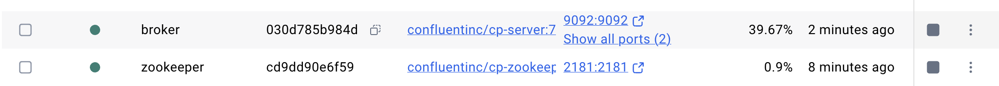

# Real-Time-Data-Streaming
🔧 Project Overview
This project demonstrates a real-time data streaming architecture built using modern data engineering tools. It simulates real-world scenarios by fetching random user data from an external API, pushing it into a Kafka topic, processing it with Apache Spark, and persisting it into Apache Cassandra — all orchestrated using Apache Airflow and containerized using Docker Compose.
<!-- ./realTIme_PIC/architecture.pn -->

  

---

## 🔧 Tech Stack

- **Apache Kafka** – Message broker for real-time data streaming
- **Apache Airflow** – DAG scheduler for orchestrating ETL tasks
- **Apache Spark** – Stream processing with structured streaming
- **Apache Cassandra** – NoSQL database for scalable data storage
- **Docker Compose** – Multi-container orchestration
- **PostgreSQL** – Backend metadata DB for Airflow
- **Schema Registry & Control Center** – Kafka schema & monitoring

## 📁 Folder Structure
├── dags/ # Airflow DAGs for data generation and Kafka streaming
│ └── kafka_stream.py
├── script/
│ └── entrypoint.sh # Entrypoint for Airflow containers
├── spark_stream.py # Main Spark job for Kafka to Cassandra
├── docker-compose.yml # Service definitions
├── Dockerfile # (Optional) Build Spark images
├── requirements.txt # Python requirements
├── run.sh, run-docker.sh # Helper scripts
└── jars/, path/, venv/ # (Optional) Dependencies and paths

🚀 Project Flow: Step-by-Step
1. Data Generation with Airflow
A **Airflow DAG** (kafka_stream.py) scheduled to run daily.

Uses the `randomuser.me` API to generate fake user data.

Sends the formatted JSON records to the Kafka topic users_created.

  

2. Kafka Broker
Manages message streaming between producers and consumers.

Configured with Zookeeper, Schema Registry, and Control Center via Docker Compose.

3. Apache Spark Streaming
Connects to **Kafka** to consume the users_created stream.
Transforms JSON messages using Spark SQL.
Writes the resulting data to Apache Cassandra in real-time.

  

4. Apache Cassandra
Stores the processed records in a table created_users within keyspace spark_streams.
Cassandra connection and table creation handled by spark_stream.py.
Check Cassandra:

  

Ports:
Airflow Web UI: localhost:8080
Kafka Control Center: localhost:9021
PostgreSQL DB: exposed on port 5432
Cassandra DB: accessible on port 9042

Docker check:

 
    
    

Use cqlsh to query data:
<pre lang="markdown">  SELECT * FROM spark_streams.created_users;  </pre>